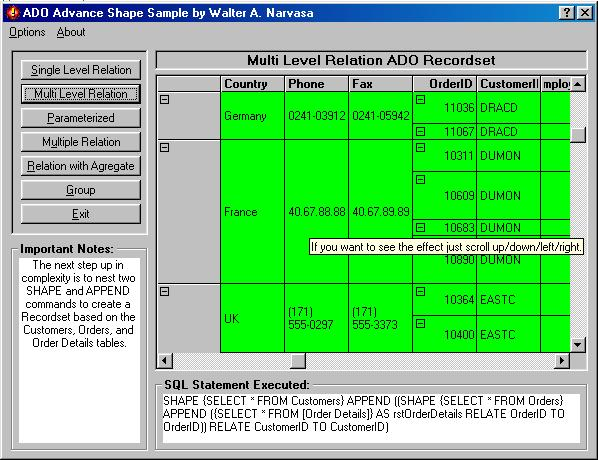



## ADO ADVANCED DATABASE SHAPING \(A brief tutorial\.\.a must see\!\!\)

### Description

This uses a Microsoft Hierarchical Flexgrid Control 6.0 which is an OCX control of your VB6. This demonstrates on how to relate different kinds of SQL using ADO. This provides tutorial to all. Don't forget to vote for it.
 
### More Info
 

             |
---                |---
**Submitted On**   |2001-01-30 00:43:08
**By**             |[Walter Narvasa](https://github.com/Planet-Source-Code/PSCIndex/blob/master/ByAuthor/walter-narvasa.md)
**Level**          |Advanced
**User Rating**    |4.8 (292 globes from 61 users)
**Compatibility**  |VB 6\.0
**Category**       |[Databases/ Data Access/ DAO/ ADO](https://github.com/Planet-Source-Code/PSCIndex/blob/master/ByCategory/databases-data-access-dao-ado__1-6.md)
**World**          |[Visual Basic](https://github.com/Planet-Source-Code/PSCIndex/blob/master/ByWorld/visual-basic.md)
**Archive File**   |[CODE\_UPLOAD142761292001\.zip](https://github.com/Planet-Source-Code/walter-narvasa-ado-advanced-database-shaping-a-brief-tutorial-a-must-see__1-14799/archive/master.zip)

